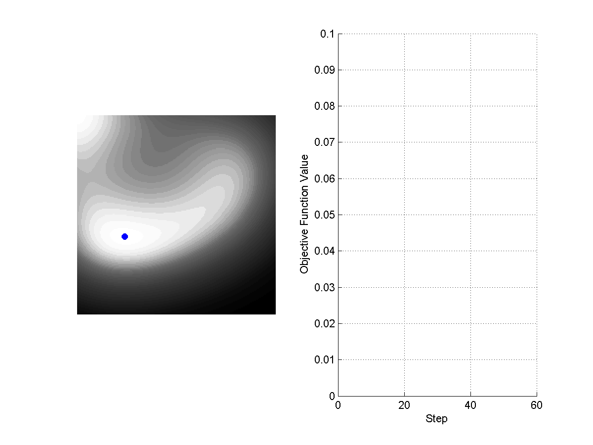
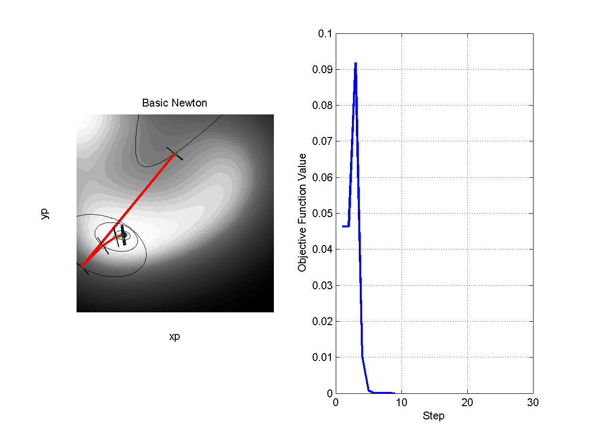
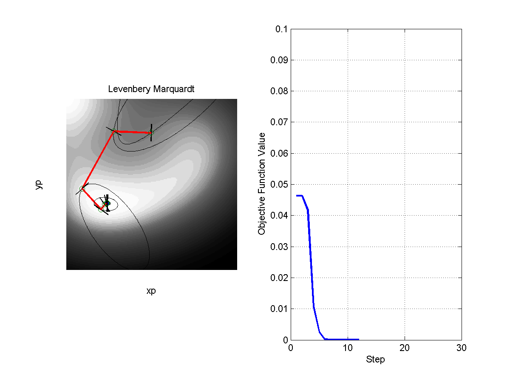
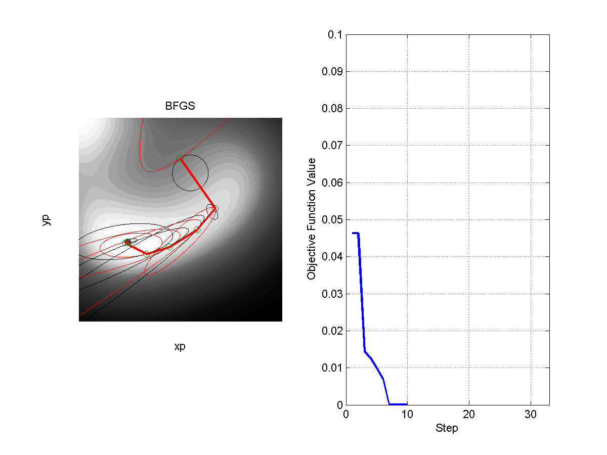

# Visualization of numerical optimization algorithms

Numerical optimization is one of the core math foundations in image processing and machine learning. But I remember in the beginning of my Ph.D. years, the math behind always made me frustrated 🙁🙁.

During the winter vacation of 2016, I decided to make a change. I revisited some well-known optimization methods (e.g., Gradient Descent, Newton/Quasi-Newton Method, ALM, etc.), and made a series of GIF visualizations to show how these algorithms behave dynamically. Check out this repository and hope it can help you better understand these algorithms.

## Gradient Descent Methods.

**Fixed step size**: Step size=0.5.

**Fixed step size**: Step size=0.1. 

**Fixed step size**: Step size=1. 

**Gradient decent with the Nesterov Momentum**. 

**Steepest Descent Method**. The step size is determined by using line-search towards the gradient decent direction. The "zigzag" trajectory may cause slow convergence at ill-conditioned regions.

## Conjugate Gradient Descent and Coordinate Descent Methods.

**Fletcher-Reeves (FR)**. The FR conjugate gradient method may have very slow convergence rate if the step size is not well controlled. 

**Polakhe-Ribiere-Polyak (RPR)**. The PRP method is usually better than FR for ill-conditioned problems. Note that although it is called a "conjugate" method, the update direction (red line) is usually not vertical to the true gradient direction (black line).

**Coordinate Descent**. The coordinate descent method selects only one coordinate at one time for update. The well-known LibLinear package incorporates this idea to solve the linear SVM. In ill-conditioned regions, this algorithm may also face the "zigzag-step" problem.

## Newton Methods.

**Basic Newton Method**. The black curve is the contour of the 2nd order approximation of the objective function. As the Hessian matrix at the initial point is non-positive, the optimization is not stable at very early steps.

**Levenbery-Marquardt (LM) Method**. LM method improves the stability of the basic Newton method by adding a small diagonal matrix to the Hessian matrix. This algorithm also can be seen as an integration of the basic Newton method and the gradient descent method.

**Damped Newton Method**. Damped Newton method can be viewed as a  combination of the basic Newton method and the line-search based method. In spite of the fact that the Hessian matrix may be non-positive, the convergance can still be guaranteed.

**Broyden Fletcher Goldfarb Shanno (BFGS)**. The BFGS method is the representative of quasi-Newton methods. It takes the first order gradients  to approximate the Hessian matrix. In this figure, the red curve represents the true second-order information, while the black curve represents an approximated one by using BFGS.

**Gaussian Newton Least Square Method (GNLS)**. The Gaussian-Newton least square method is a classical algorithm for solving nonlinear least squares regression problems. The essence of this algorithm is to use the first order Jacobian matrix (black curve) as an approximation of the Hessian matrix (red curve).

## Random search algorithm

**Genetic Algorithm (GA)**. GA is a classical algorithm to solve non-convex optimization problems. The key to this algorithm can be summarized as: "breeding", "mutation" and "natural selection". In this figure, the green scatters represent the descendants and the red ones represent the result of natural selection.

**Simulated Annealing Algorithm (SAA)**. SAA is another kind of classical algorithm to solve nonconvex optimization problems. In this figure, the red curve on the right corresponds to  the "temperature" and the blue curve corresponds to  the objective function value. The objective function value converges with the decrease of the temperature.

## Constrained Optimization Method

**Gradient Projection Method (GPM)**. GPM is the most straight-forward way to solve a constrained optimization problem. In each interation, the gradient is projected to the feasible domain to make the current point satisfies the constraints.

**Exterior-Point Penalty Method**. The exterior-point penalty method is a classical way to solve constrained optimization problems. The key to this algorithm is to penalize the objective function outside the feasible domain so that to convert the original constrained problem into an unconstrained one. Note that the objectve may become ill-conditioned at the boundary of the constraints.

**Inner-Point Barrier Method**. The Inner-Point Barrier Method is another classical way to solve constrained optimization problems. Different from the exterior-point penalty methods where the objective is penalized outside the feasible region, the inner-point barrier method constructs a barrier function at the boundary of the feasible domain so that to prevent crossing the boundary. Similar to the exterior-point penalty method, the objectve may become ill-conditioned at the boundary of the constraints.

**Lagrange Dual Ascent Method**. By adding a Lagrangian multiplier, any constrained problem can be equally converted to an unconstrained max-min problem . In the Lagrange Dual Ascent Method, the variable x and the Lagrangian multiplier coefficient are alternately updated. Note that when the background color changes, the Lagrangian multiplier started to be taken into consideration during the updates.

**Augmented Lagrangian Method** (ALM). ALM is designed based on the Lagrange Dual Ascent Method by adding a penalty function as Augmented Lagrangian multipliers. ALM is more robust at ill-conditioned regions, e.g., at the boundary of constraints.

_"keep Calm and Don't Overfit."_
